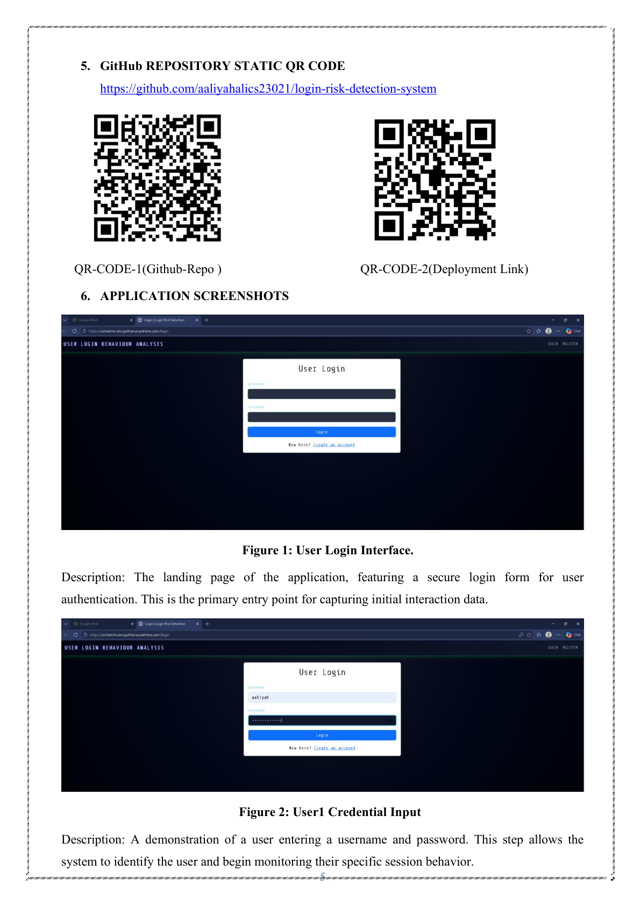
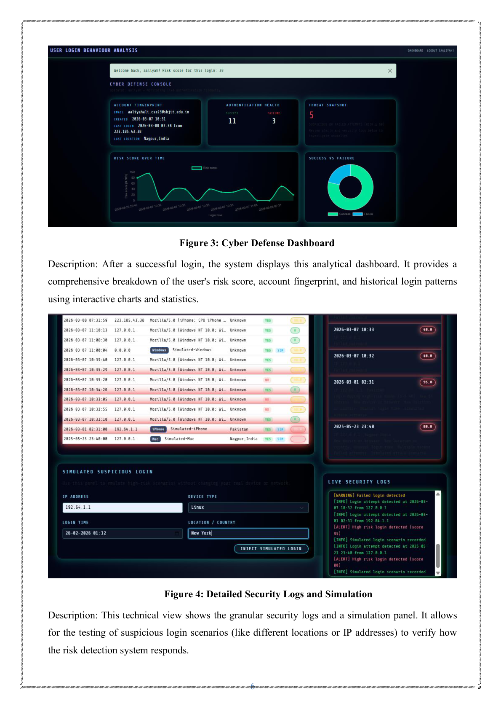
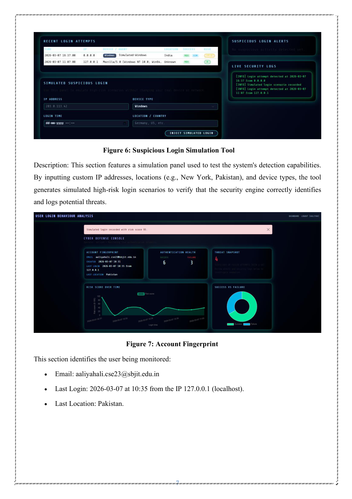
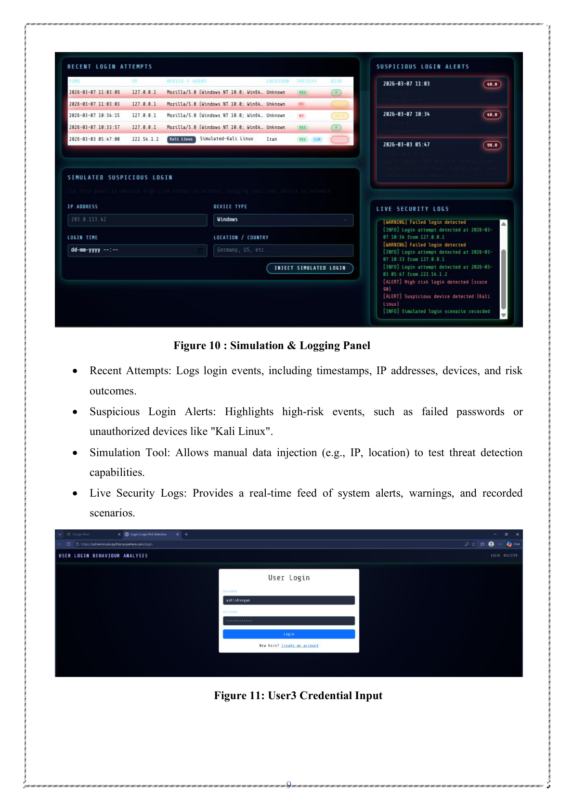

# 🔐 User Login Behavior Analysis & Risk Detection System

A cybersecurity-focused web application that analyzes user login behavior to identify suspicious login attempts based on factors such as IP address, device, location, login time, and historical login patterns. The system assigns a risk score, generates alerts for suspicious activity, and provides an interactive security dashboard for monitoring login events.

---

## ✨ Features

- 🔑 Secure user authentication
- 🌍 Login analysis using IP, location & device
- ⚠️ Risk score calculation for every login
- 📊 Interactive Cyber Defense Dashboard
- 📝 Live security logs & recent login history
- 🧪 Suspicious login simulation tool
- 🚨 Automated suspicious login alerts
- 📈 Risk score visualization & analytics

---

## 📸 Screenshots

### 🔐 Login Interface

---

### 📊 Cyber Defense Dashboard

---

### 📝 Security Logs & Analytics

---

### 🧪 Suspicious Login Simulation

---

## ⚙️ Tech Stack

- **Frontend:** HTML, CSS, JavaScript
- **Backend:** Python, Flask
- **Database:** SQLite
- **Libraries:** Flask, Pandas
- **Deployment:** PythonAnywhere

---

## 🚀 How It Works

1. User logs into the application.
2. The system captures login metadata (IP, location, device, time).
3. Login behavior is analyzed against previous activity.
4. A risk score is generated.
5. Suspicious attempts trigger alerts and are stored in security logs.
6. Administrators can monitor activity through the dashboard and simulate attack scenarios.

---

## 🎯 Applications

- User Authentication Systems
- Banking & Financial Platforms
- Enterprise Security
- E-commerce Websites
- Educational Portals
- Cloud-based Applications

---

## ✅ Key Features

- Detects suspicious login attempts
- Monitors user behavior in real time
- Generates security alerts
- Interactive dashboard with analytics
- Supports login simulation for testing
- Easy-to-use web interface

---

## 📌 Conclusion

The User Login Behavior Analysis & Risk Detection System enhances account security by continuously monitoring login behavior and identifying abnormal access patterns. It provides an additional layer of protection through risk analysis, visualization, and real-time security monitoring.
